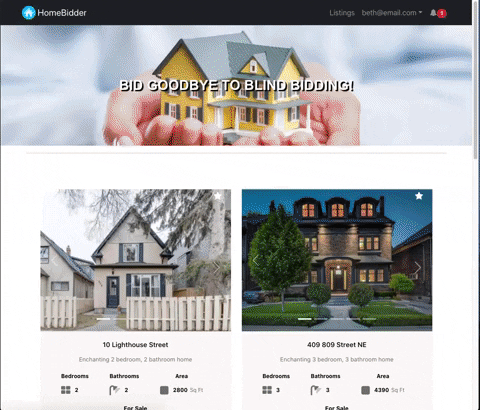
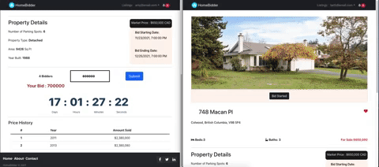
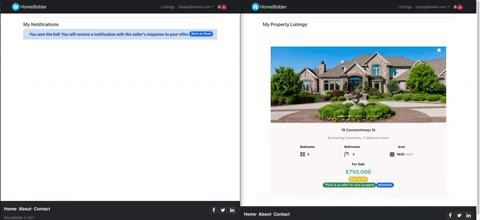
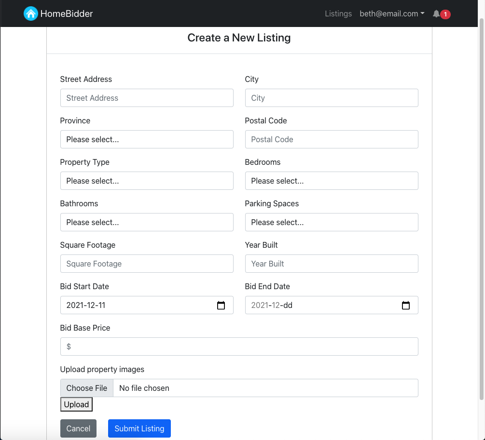

# HomeBidder

## Summary

**HomeBidder** is an online platform for buying and selling homes without the use of blind-bidding. Instead of making an offer on a home without knowing the offers that have already been made, **HomeBidder** empowers buyers by putting the tools and data they need at their fingertips to help inform their decision-making during this critical process.

With **HomeBidder**, buyers participate in live bidding sessions for a home and can see other offers updated in real time as they are made. They can then make or adjust their own offers with greater confidence and transparency.

**HomeBidder** was built by 3 **enthusiastic** grads of **Lighthouse Labs**' web development bootcamp as our final project using the following:

**Backend**:  Node, Express, PostgresQL, socket.io (for live bidding and real-time updates)

**Frontend**:  React, React-Bootstrap, CSS

---
## Contributors

- [Rameesa Rijas](https://github.com/RameesaRijas)
- [Mays Al Raheem](https://github.com/mays4)
- [Hasan Lam](https://github.com/HCBLam)

---
## Features

#### Browse listings, add to favourites, register for a bidding session!

#### Participate in a live bidding session, make or adjust bid amounts!

#### Be notified when offers are made or accepted!

#### Create a new listing for sale!

---
## Future Developments
- We would love to add a map API with a fully-filterable search function
- Also high on our list is to add a real estate API

---
## Setup
- Install dependencies for each of the 'frontend' and 'homebidder-api' directories using: `npm install`

- Reset the database in the 'homebidder-api' directory using: `npm run db:reset`

- Run the backend server in the 'homebidder-api' directory using: `npm start`

- Run the frontend React in the 'frontend' directory using: `npm start`

- In your browser, go to:  `http://localhost:3000`

---
## Dependencies

#### Backend
- bcryptjs
- chalk
- cookie-parser
- cookie-session
- cors
- jsonwebtoken
- socket.io

#### Frontend
- axios
- bootstrap
- font-awesome
- react-bootstrap
- react-confirm-bootstrap
- react-router-dom
- react-toastify
- socket.io-client

